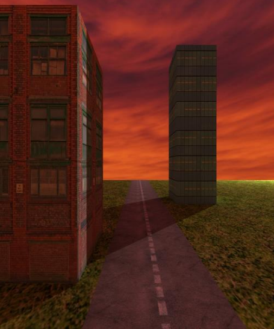
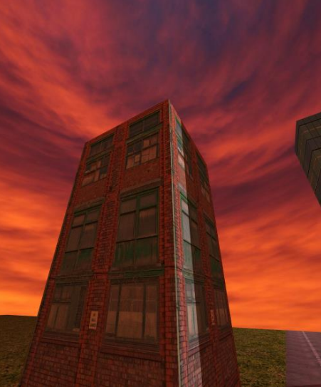
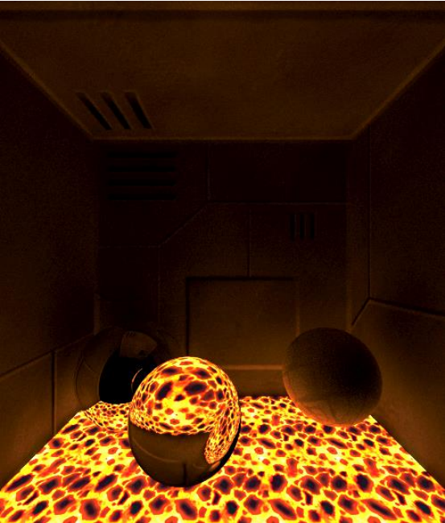
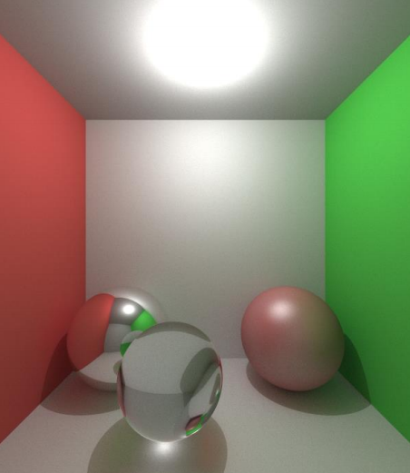
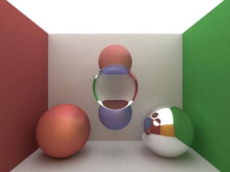

**Path Tracer** desarrollado para la asignatura Informática gráfica de la Universidad de Zaragoza

Consiste en un renderizador que utiliza el algoritmo de trazado de rayos path tracer. 

Implementa:
- Texturas con interpolación múltiple
- Texturas luminosas
- Volumenes simples
- Volumenes compuestos
- Cámara movil
- Transformaciones utilizando coordenadas homogéneas
- Luces puntuales
- Luces de área

